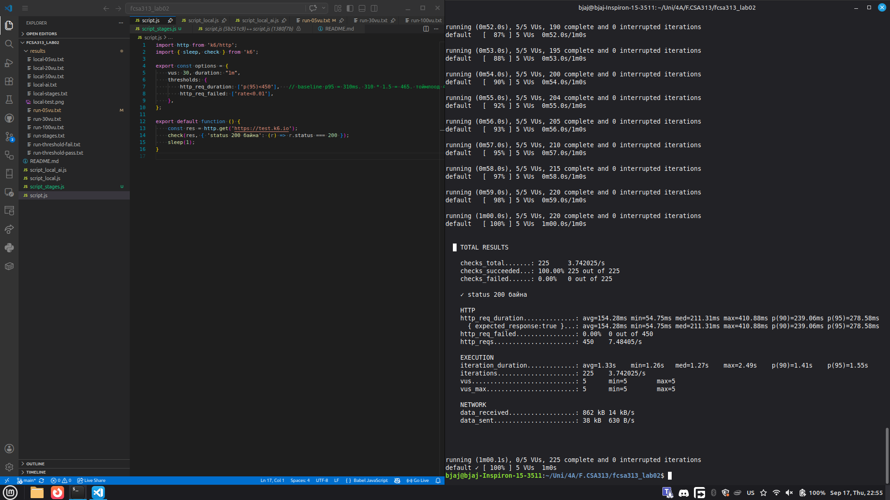
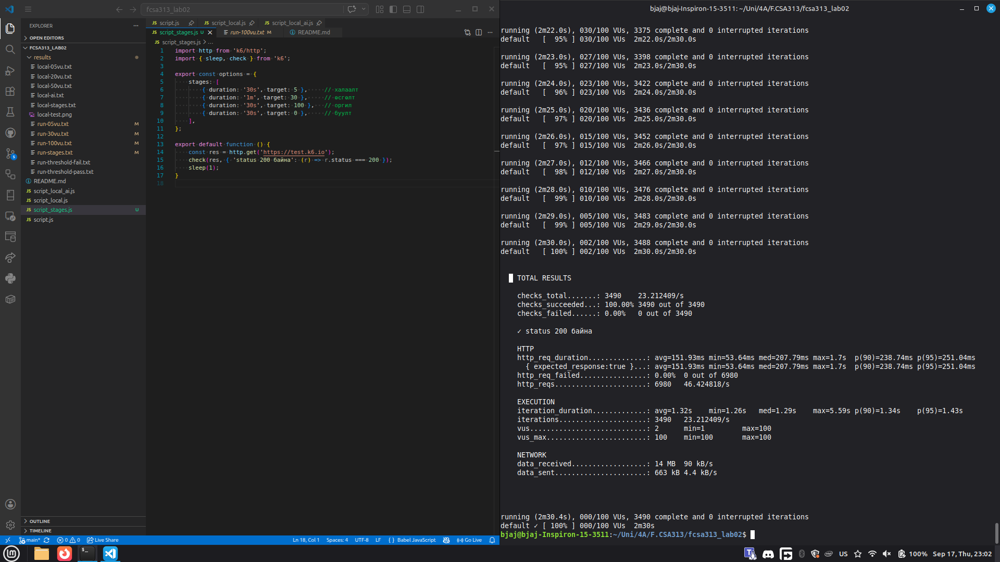
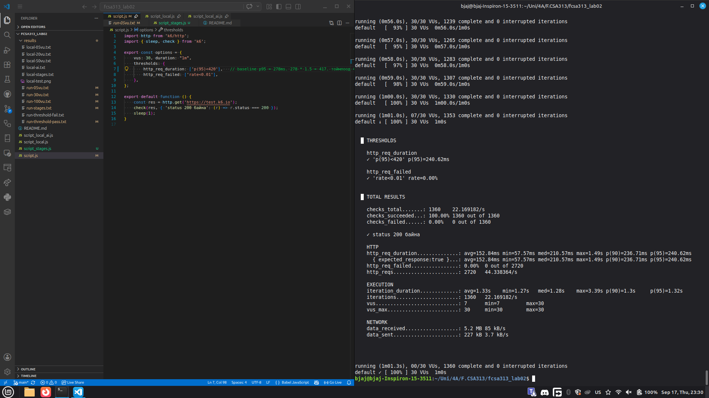
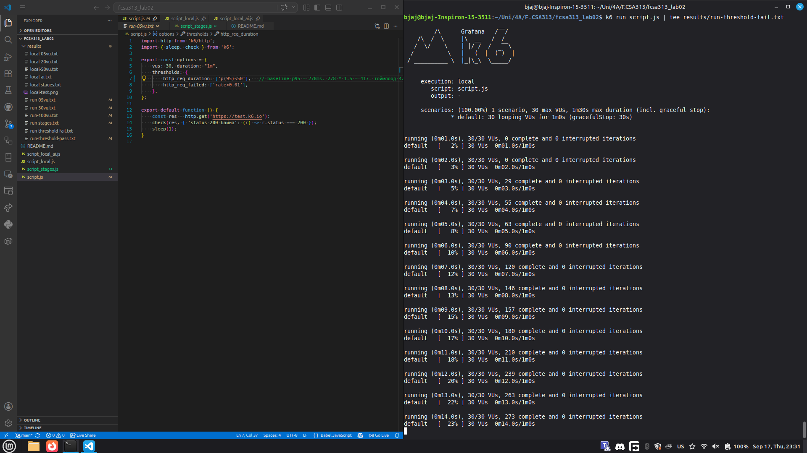
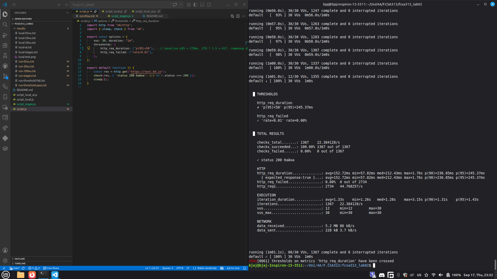
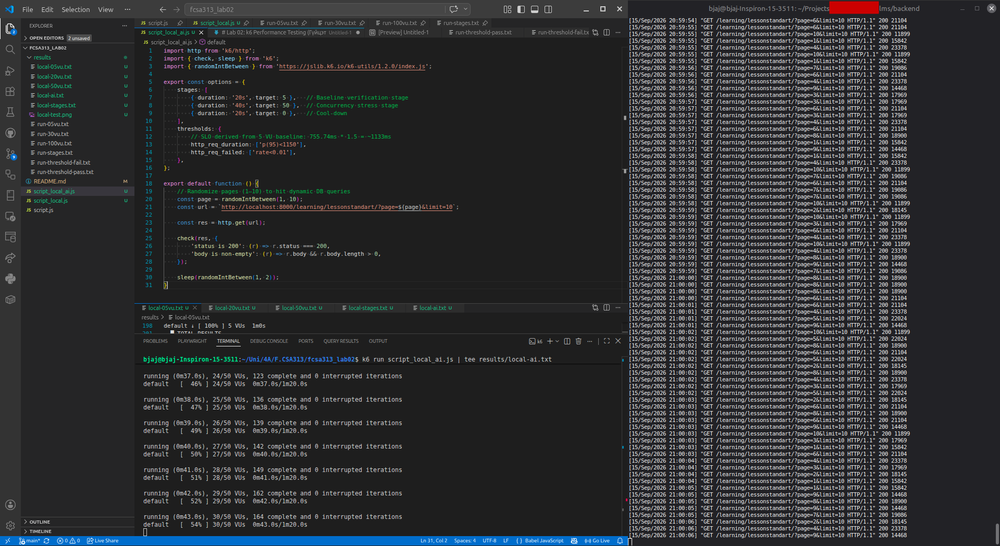

# Лаб 02 - B232270068 А.Баяржавхлан

## Туршилтын орчин
- k6 хувилбар: `k6 v2.2.0 (commit/00a9a1b7f5, go1.26.5, linux/amd64)`
- Үйлдлийн систем: Linux Mint 22.3
- Тест хийсэн вебсайт: `https://test.k6.io`

## Гурван түвшний хэмжилт

Тус бүр 1 минут ажиллуулсан хэмжилтийн үр дүн:

| VU тоо | p90 (ms) | p95 (ms) | Throughput        | Error rate |
| -----: | -------- | -------- | ----------------- | ---------- |
|      5 | 239.06   | 278.58   | 7.48 хүсэлт/сек   | 0%         |
|     30 | 223.08   | 236.78   | 44.12 хүсэлт/сек  | 0%         |
|    100 | 245.02   | 258.78   | 144.17 хүсэлт/сек | 0%         |

Үр дүнгийн файлууд: [results/run-05vu.txt](results/run-05vu.txt), [results/run-30vu.txt](results/run-30vu.txt), [results/run-100vu.txt](results/run-100vu.txt)

Screenshot-ууд:




### Олон шаттай (Stages) хэмжилт

`stages` тохиргоо ашиглан олон шаттай ачааллын туршилтыг ажиллуулсан үр дүн [results/run-stages.txt](results/run-stages.txt):
- **p(90):** 238.74 ms
- **p(95):** 251.04 ms
- **Throughput:** 46.42 хүсэлт/сек
- **Error rate:** 0%



*`options`-д `stages` ашигласан тест кодыг дараа нь `thresholds` болгож өөрчилсөн учраас тусад нь [script_stages.js](script_stages.js) файлд хадгалав.*

## Threshold (SLO) тохируулан хийсэн хэмжилт

5 VU-тэй туршилтын p95 latency нь 278.58 мс гэдгээс SLO threshold-оо $278.58 \cdot 1.5=417.87 \approx 420$ мс гэж тохируулсан.
30 VU ажиллуулж хэмжихэд `p(95)=240.62ms, rate=0.00%` үр дүн гарч, тестийг давсан. [results/run-threshold-pass.txt](results/run-threshold-pass.txt)




Харин latency threshold-оо 50мс гэж тохируулж, албаар унагахад дараах үр дүн гарсан: [results/run-threshold-fail.txt](results/run-threshold-fail.txt)





*Энэ албаар унагах тестийг [script_fail.js](script_fail.js) нэртэйгээр хадгалсан*

## Дүгнэлт

VU-ийн тоог 5-аас 100 хүртэл нэмэгдүүлэхэд throughput нь секундэд 7.48 хүсэлтээс 144.17 хүсэлт болж өссөн. `test.k6.io` сервер нь 5-аас 100 VU хүртэл ачаалал өгөхөд p95 latency 236-278 мс орчим тогтвортой, error rate 0% байв. Энэ нь тухайн веб сервер ачаалал даах өндөр чадвартайг харуулж байна. Гэхдээ энэ үр дүнд интернетийн хурд нөлөөлсөн байж болзошгүй. Хамгийн бага ачаалалтай буюу 5 VU-тэй туршилтын үед p95 latency 278.58 мс буюу хамгийн өндөр гарсан нь үүнийг илтгэж байна.

SLO latency threshold-ийг 5 VU-тэй туршилтын p95 буюу 278.58 мс-ийг 1.5-аар үржүүлэн 417.87 мс гэж бодсныг тоймлон 420 мс гэж тодорхойлсон. 30 VU ажиллуулсан туршилтад p95 latency 240.62 мс гарсан тул уг шаардлага бүрэн хангагдсан. Error rate 0% байсан тул алдааны хувьтай холбоотой SLO мөн хангагдсан.

Threshold latency-г албаар хүндрүүлэхэд k6 нь үр дүнгийн `THRESHOLD` хэсэгт `http_req_duration` буюу latency хэмжилтэд унасан болохыг харуулж, мөн error buffer-д `thresholds on metrics 'http_req_duration' have been crossed` гэсэн алдаа хэвлэж байна. Энэ нь k6 ашиглан SLO хангагдаж байгааг автоматаар шалгах боломжтойг харуулж байна.


## Локал сервер дээр хийсэн хэмжилт, AI ашиглан бичсэн тест

Django framework ашиглан бичсэн их сургуулийн сургалтын системийг локал орчинд дахь өгөгдлийн сан болон сервер дээр ажиллуулж, нэвтрэлт шаарддаггүй нэг API сонгон авч туршсан. Эхлээд baseline хэмжилт авахад p95=1.28 сек байсан. Систем нь өөрөө цөөн хэрэглэгчтэй, API нь өгөгдөл дамжуулах зориулалттай, development сервер нь бодит серверээс удаан ажиллах тул ихдээ 50 VU-тэй туршилт хийсэн. Өөрийн хийсэн хэмжилтүүдийн үр дүнг хүснэгтэд харуулав.

|      VU тоо | p90 (s) | p95 (s) | Throughput      | Error rate |
| ----------: | ------- | ------- | --------------- | ---------- |
|           5 | 0.702   | 0.756   | 3.64 хүсэлт/сек | 0%         |
|          20 | 2.45    | 2.5     | 6.45 хүсэлт/сек | 0%         |
|          50 | 6.97    | 7.13    | 6.54 хүсэлт/сек | 0%         |
| олон шаттай | 5.64    | 6.11    | 5.48 хүсэлт/сек | 0%         |

Хэмжилтээс харахад throughput нь VU тооноос хамаарч өсөхгүйгээр секундэд 6.5 хүсэлтээс бараг илүү гарахгүй, latency нь VU тоог даган өсөж байгаа нь энэ сервер (эсвэл API) нь ачаалал авах чадваргүй, ямар нэгэн bottleneck-тэй байгааг харуулж байна.


### AI-аар бичүүлсэн тестүүд
Локал сервер дээр load test хийх script-ыг AI-аар бичүүлж үзсэн.
Prompt-ийн агуулга:
> `http://localhost:8000/learning/lessonstandart/?page=1&limit=10` API-д зориулан k6 load test бич. 5 VU-тэй энгийн туршилтийн үр дүн: энд [results/local-05vu.txt](results/local-05vu.txt) хэмжилтийн үр дүн хэсгийг өгсөн.

Gemini 3.5 Flash-Lite-аар бичүүлэхэд зөвхөн `vus`, `duration`-ийг тохируулсан, харин ChatGPT 5.6 Luna 1000ms threshold тааруулсан. Хоёул VU тоог 5-аас өөрөөр өгөөгүй. ChatGPT-ийн анх бичсэн тест:

```
import http from 'k6/http';
import { check } from 'k6';

export const options = {
  vus: 5,
  duration: '1m',

  thresholds: {
    http_req_failed: ['rate<0.01'],
    http_req_duration: ['p(95)<1000'],
  },
};

export default function () {
  const url =
    'http://localhost:8000/learning/lessonstandart/?page=1&limit=10';

  const response = http.get(url);

  check(response, {
    'status is 200': (r) => r.status === 200,
  });
}
```

Харин дээрх prompt-ийг "сайн тест бич" гэсэн агуулгатай болгон, Gemini 3.6 Flash Extended моделд өгөхөд [script_local_ai.js](script_local_ai.js) тестийг бичсэн. Локал сервер дээр ажиллуулж байгааг батлах зураг доор орууллаа (баруун талд сервер console харагдаж байгаа).



AI-р бичсэн тестийг өөрийнхтэйгөө харьцуулахад SLO threshold-г өгсөн өгөгдлийг ашиглан тооцож, stages ашигласан. Мөн хүсэлт бүрийн авч буй хуудсын дугаар болон хүсэлт хоорондын хугацааг санамсаргүйгээр сонгодог болгосон. Дутмаг тал ажиглагдаагүй.

AI-р бичүүлсэн тест бүр алдаагүй ажилласан. Gemini 3.6 Flash Extended моделийн бичсэн тестийн үр дүнг [results/local-ai.txt](results/local-ai.txt) файлд хадгалсан.
